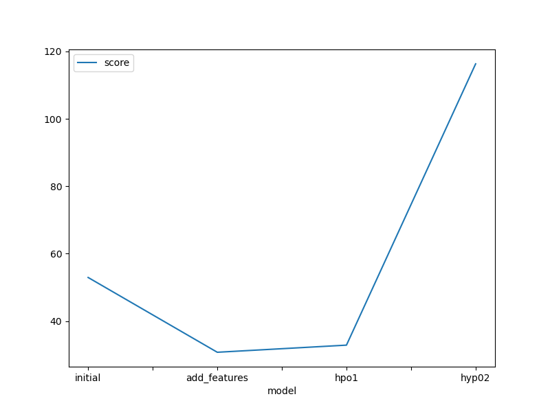
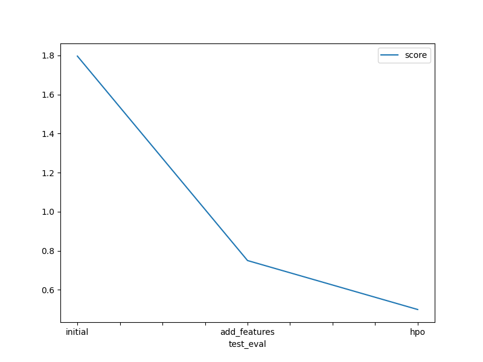

# Report: Predict Bike Sharing Demand with AutoGluon Solution
#### Ogunsanaya James Oyindamola

## Initial Training
### What did you realize when you tried to submit your predictions? What changes were needed to the output of the predictor to submit your results?
When I tried submitting the initial predictions, there was no problem. The submission was successful.
### What was the top ranked model that performed?
WeightedEnsemble_L3 was the best performing model with a val score of -53.01.

## Exploratory data analysis and feature creation
### What did the exploratory analysis find and how did you add additional features?
The histogram of the train data showed that datetime was not captured, because it was not recognized as a float or numerical variable. I added three new features from the datetime object, namely hour, day and month.
### How much better did your model preform after adding additional features and why do you think that is?
The model performed far better after adding the hour, day and month features. Kaggle scored decreased from 1.7 to 0.7. The increase in the performance of the model may be as a result of more features, so the algorithm was able to capture more complexity the other features could not explain. 

## Hyper parameter tuning
### How much better did your model preform after trying different hyper parameters?
TODO: Add your explanation
I tried two different hyperparameters, the first was increasing the training time and removing poorly performing models. The first increased the model performance and a kaggle score of 0.4. The second hyperparameter where I added hyperparameter_tune_kwargs of
```
{
    'num_trials': 3,
    'scheduler' : 'local',
    'searcher': 'auto',
}
```
the model performance decreased with a kaggle score of 1.4. When I read the documentation, it was advised not to tune the hyparameters.

### If you were given more time with this dataset, where do you think you would spend more time?
I will spend more time on the featuring engineering, it seems that is the only part of the workflow that can be automated yet.

### Create a table with the models you ran, the hyperparameters modified, and the kaggle score.
|model|hpo1|hpo2|hpo3|score|
|--|--|--|--|--|
|initial|default|default|default|1.8|
|add_features|default|default|default|0.75|
|hpo|default|removed poor performing model|Time|0.50|


### Create a line plot showing the top model score for the three (or more) training runs during the project.



### Create a line plot showing the top kaggle score for the three (or more) prediction submissions during the project.



## Summary

This project focused on automating machine learning workflows using AutoGluon, exploring the importance of feature engineering, and emphasizing the significance of exploratory data analysis (EDA). WeightedEnsemble_L3 was the best performing model at all the different instances.

### Key Findings:

- Automation with AutoGluon: Utilizing AutoGluon facilitated the automation of complex machine learning tasks such as hyperparameter tuning and model selection. This automation significantly reduced manual effort and streamlined the overall workflow.

- Feature Importance: Understanding feature importance played a pivotal role in improving model performance. By identifying influential features, we could prioritize feature engineering efforts and optimize model accuracy.

- Exploratory Data Analysis (EDA): Thorough EDA revealed valuable insights about the dataset, including underlying patterns, correlations, and relationships between variables. This deep understanding guided feature selection and engineering, leading to more informed modeling decisions.

